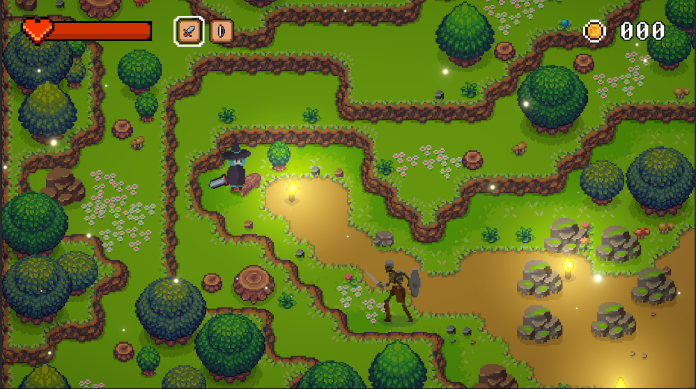

# Hylla's Quest

This is the full version of my 2D top-down game made in Unity.

## How to Run this Unity Game

### 1. Clone the Repository
To download the game files, open your terminal or command prompt and run this command:

`git clone https://github.com/Princejaphet07/Hyllas-Quest.git`

### 2. Open the Project in Unity
- Open **Unity Hub**.
- Click **Open**.
- Locate and select the cloned folder.
- **Note:** Unity will automatically import all assets the first time you open the project. Please wait a moment for the loading to finish.

### 3. Open the Main Scene and Run the Game
- Inside Unity, navigate to the **Assets > Scenes** folder.
- Double-click the Main Menu or Main Scene.
- Click the **Play button (▶)** at the top to start playing!
